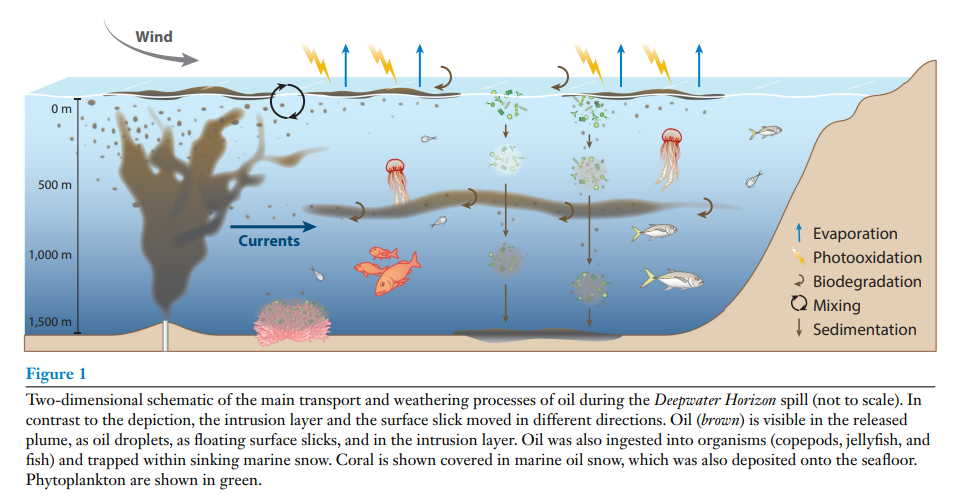
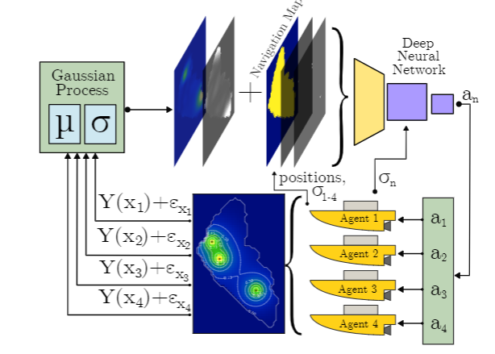
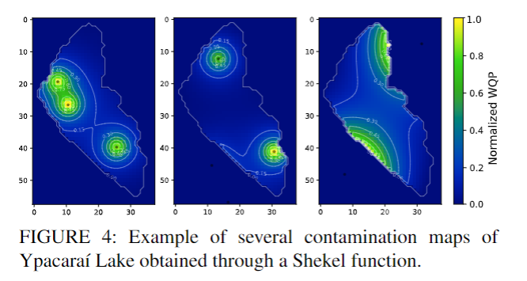

# Aim of the TFM

The aim of this master's thesis will be to use RL algorithms to control ASVs to map marine events, in particular, oil spills and harmful algae blooms, with the possibility to expand it to posidonia fields and other similar environments. The motivation being, to develop more accurate, more reliable or cheaper/more accesible methods than the current SOTA.

These are the potential advantages that come to mind when thinking of Autonomous Underwater Vehicles (AUVs) over other commonly used detection methods:

- **Higher accuracy in the detection:** 
  Certain types of events might be hard to pasively be observed, for example, oil spills were the oil makes a transparent shim, if observed from far away with a satellite or UAV, might be hard to distinguish the oil from the water
- **Cheaper:**
  Developing and deploying an autonomous surface vehicle could potentially be much cheaper than deploying a satellite or a human crew.
- **Underwater and direct observation:**
  Since marine events are not limited to what happens on the surface, having the posibility to explore underwater expands the utility of the vehicle. Also, pasive methods like satelites cannot be used to gather physiscal samples. [This paper](papers/why_sample_oil_spills_paper.pdf) talks about the importance of gathering physical samples.

In [this paper](papers/oil_spill_disaster_management_summary.pdf), the authors define 3 hours as the maximum time after the oil spill has occurred where mapping from a satellite or aircraft is still useful. On the other hand, this paper states [sampling](papers/why_sample_oil_spills_paper.pdf) is still useful on the long term to assess the evolution of the impacts.

Using Reinforcement Learning (RL) algorithms to control the AUVs could potentially be a more robust solution over non-RL methods.

# Prior Research

In this section I want to summarize the previous work and research on the topic and topics related, which will be separated into various sections.

- **Research about the events that will be mapped (oil-spills, harmful algae blooms):** 
  - why is it important to detect and map these events?
    [this paper](papers/impact_of_oil_spills.pdf) highlights the importance of studying oil spills and their impact on marine ecosystems. 
  - what are the different techniques used to detect them (sampling, remote, etc)?
    mainly passive aerial or space observation using radar, infrared or visual methods, some described in  [this paper](papers/remote_sensing_oil_spills.pdf) about remote sensing.
    in-situ sampling is also a very important part of oil spill monitoring [this paper](papers/in_situ_sampling_with_microwaves.pdf) describes one of the techniques used.
  - how do they usually evolve over time?
    [this paper](papers/evolution_of_oil_spils.pdf) mentions multiple factors like evaporation, emulsification with the water, photooxidation, etc. that affect how the oil spills evolve. This would be a very good point to differentiate this work from [this](papers/Informative_Deep_Reinforcement_Path_Planning_for_H.pdf) very similar previous work.
    This figure from the [mentioned](papers/evolution_of_oil_spils.pdf) paper illustrated the different processes the oil experiences.
    
  - are there available datasets describing these events?
    a good dataset to compare the performance against passive methods is presented in [this paper](papers/oil_spill_annotated_dataset.pdf). There are other datasets describing the properties of the spills, including the chemical characteristics and severity, but this one is very usefull as it could be used to train a segmentation model (possibly a UNet or whatever is the SOTA for this application) to compare the precision of passive methods vs active ones.
- **Non RL techniques for efficient mapping:**
   
    most of the research I found focuses on optimal path planning for complete coverage, as an example:
    [Smooth Complete Coverage Trajectory Planning Algorithm for
a Nonholonomic Robot](papers/complete_coverage_algorithm.pdf).

    I imagine the solution for this TFM to be more focused on dynamic environments where the event that is going to be mapped changes with time, in that case, the value or utility would be in an algorithm that produces paths that most effectively cover the event (oilspill or HAE) as it changes, and not necessarily covers the search area entirely.

- **Existing MARL solutions:**
    I see the solution proposed in [Informative Deep Reinforcement Path
    Planning for Heterogeneous
    Autonomous Surface Vehicles in large
    water resources](papers/Informative_Deep_Reinforcement_Path_Planning_for_H.pdf) as a strong candidate for the RL baseline to improve upon. The methods they use (single shared DQN for Centralized Training with Decentralized Execution), may be improvable. 

    

    They model the environment as a discretized grid map of Ypacaraí Lake where a static, unknown ground truth contamination field, generated by a Shekel function for each episode, is present; agents interact by taking noisy sensor measurements and cooperatively build a probabilistic understanding of this contamination using Gaussian Processes, which, along with the map and agent states, forms the multi-channel observation for the reinforcement learning algorithm.

    

- **Modelization of the environment:**
  Will the environment be static or dinamic (modeling currents, wind, etc.), a discrete grid or continuous?
  This is a point which I think it's going to be very important, as the solution proposed in [the previously mentioned paper](papers/Informative_Deep_Reinforcement_Path_Planning_for_H.pdf) looks very good and covers most of the problem, but they simulate static events. The differenciation with that paper would come from investigating wether it is possible to train a MARL system to perform well in more realistic scenarios with highly dynamic events.
  As for the actions of the agent, I would say using discrete changes in the orientation of the agent might be usefull enough.